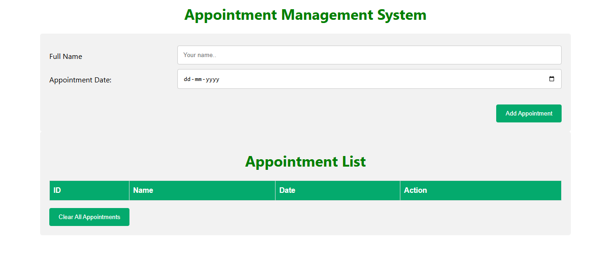

# 📅 Appointment Management System

This is a **React-based Appointment Management System** that allows users to schedule, view, and manage their appointments efficiently. It includes a simple and intuitive UI to add appointments with a name and date, view them in a list, and clear all entries with one click.

---

## 🚀 Live Demo

🌐 https://appointment-management-system-m6etfdwix.vercel.app

---

## 🧠 About This Project

This project is a part of my learning journey in **React.js** and **frontend development**.  
It helps demonstrate the use of **React hooks**, **form handling**, **state management**, and **dynamic list rendering** in a real-world mini-application.

---

## ✨ Features

- Add an appointment by entering full name and date.
- Appointments are displayed in a list with a unique ID.
- Option to **clear all appointments** with a single click.
- User-friendly and responsive interface.

---

## 🛠 Technologies Used

- **Frontend**: React, JavaScript, HTML, CSS
- **Styling**: Tailwind CSS / CSS Modules (adjust based on what you're using)
- **State Management**: React useState Hook

---

## 📷 Screenshots

---
